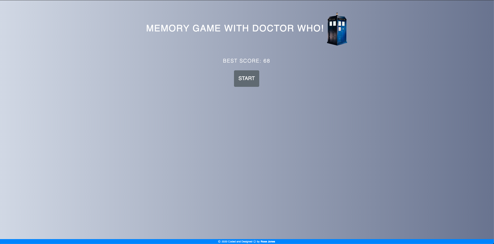

# Memory Game

This is a card-based memory game in the browser, built in HTML, CSS, and Javascript.

Players will be shown a collection of cards, face down, and can click on a card to reveal what’s underneath. After clicking on two cards, the game should check to see whether they match. If they do, they will remain facing up. If not, the cards should remain displayed to the player for a couple of seconds, and then flip back down. The goal of the game is to match up pairs of cards in as few clicks as possible.

// click cards to reveal what's behind
// click 2 cards at max ((Make sure this works only if you click on two different cards — clicking the same card twice shouldn’t count as a match!))
// if the cards match
// it stays facing up
// if not
// the cards should remain displayed to the player for a 2 seconds
// the cards will flip back down

Requirements

* User should be able to start a new game.
* Clicking a card should reveal what’s underneath it. The game should keep track and display the number of times cards have been turned over.
* Users should only be able to see at most two cards at a time.
* Store the lowest-scoring game in local storage, so that players can see a record of the best game played.

